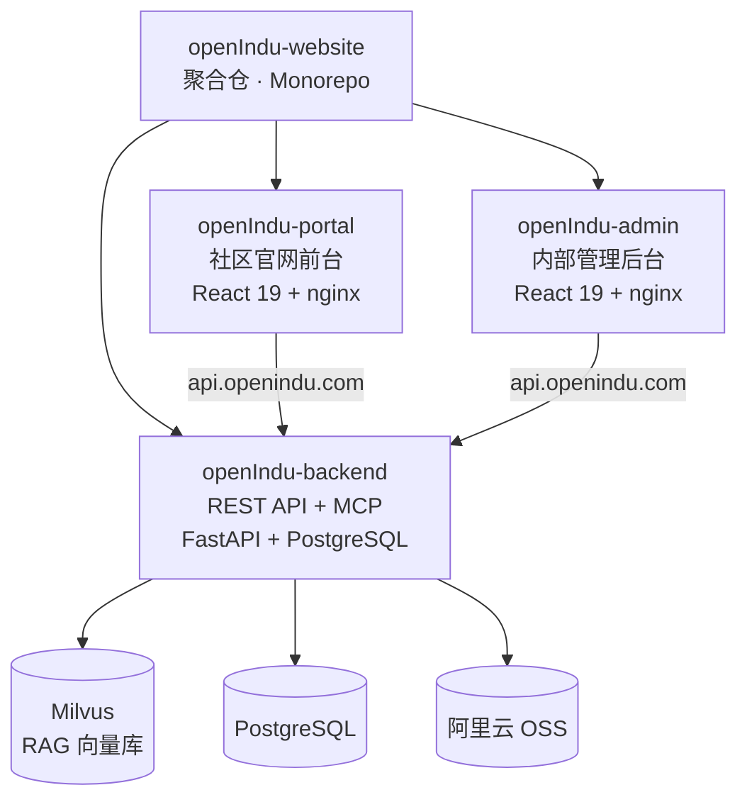

# openIndu Community

**开源智能制造解决方案 | Open Source Intelligent Manufacturing**

> 开源 · 开放 · 协作 — 致力于智能制造场景，提供 AI 赋能的工业互联网解决方案

融合运动控制、机器视觉、工业物联网平台与 AI 基础设施，由社区共同构建完整的智能制造生态。

---

## 核心项目 | Projects

### 🌐 社区官网生态

| 仓库 | 技术栈 | 说明 |
| ---- | ------ | ---- |
| [openIndu-website](https://github.com/openIndu/openIndu-website) | Monorepo | 聚合仓 — 统一管理后端、管理台、官网前台 |
| [openIndu-backend](https://github.com/openIndu/openIndu-backend) | FastAPI · PostgreSQL · Milvus | REST API + MCP Server，支持 RAG 知识库检索 |
| [openIndu-admin](https://github.com/openIndu/openIndu-admin) | React 19 · Tailwind CSS 4 | 统一管理后台 — 用户、文档、软件、系统配置 |
| [openIndu-portal](https://github.com/openIndu/openIndu-portal) | React 19 · Tailwind CSS 4 | 社区官网前台 — 知识库、软件下载、方案展示 |

### 🏭 工业平台

| 仓库 | 状态 | 说明 |
| ---- | ---- | ---- |
| [openIndu-platform](https://github.com/openIndu/openIndu-platform) | ✅ 可用 | 企业级工业物联网全栈解决方案 — 设备管理、流程控制、产品追溯一体化 |
| [openIndu-studio](https://github.com/openIndu/openIndu-studio) | ✅ 可用 | AI 工业知识库工作台 — PDF 解析、向量检索、RAG 问答 |
| [openplc-runtime](https://github.com/openIndu/openplc-runtime) | ✅ 可用 | OpenPLC 运行时适配与扩展 |
| [openIndu-controller](https://github.com/openIndu/openIndu-controller) | 🚧 即将推出 | AI + 运动控制 — 结合 AI 算法优化工业设备运动精度与效率 |
| [openIndu-vision](https://github.com/openIndu/openIndu-vision) | 🚧 即将推出 | AI + 视觉 — 基于深度学习的工业视觉检测，实现产品质量自动化检测 |

---

## 服务架构 | Services

**域名说明 | Domains**

| 域名 | 服务 | 说明 |
| ---- | ---- | ---- |
| `openindu.com` | openIndu-portal | 社区官网前台 — 知识库、软件下载、方案展示 |
| `website.openindu.com` | openIndu-website | 聚合仓首页 — 项目导航与文档入口 |
| `api.openindu.com` | openIndu-backend | REST API + MCP Server — 前后端数据接口与 AI 知识检索 |
| `backend.openindu.com` | openIndu-admin | 内部管理后台 — 用户管理、文档管理、系统配置（不对外公开） |

---

## 为什么选择开源？ | Why Open Source?

| | |
| --- | --- |
| **完全开源** | 所有核心代码公开透明，支持自由使用、修改和分发 |
| **社区驱动** | 由全球开发者共同参与建设，持续迭代优化 |
| **免费使用** | 无需授权费用，降低企业数字化转型成本 |
| **开放协作** | 欢迎提交 Issue 和 PR，共同打造工业互联网生态 |

---

## 参与贡献 | Contributing

欢迎任何形式的贡献——无论是提交 Issue、发起 PR，还是完善文档。  
请查看 [community](https://github.com/openIndu/community) 仓库了解社区规范与贡献指南。

---

© 2026 openIndu Community · [www.openindu.com](https://www.openindu.com)
