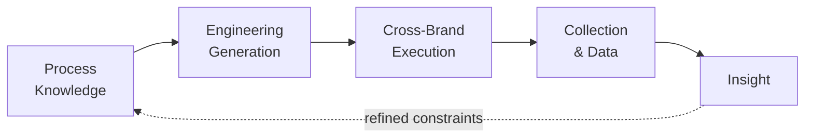

# openIndu

**One Stack, Open Manufacturing.**

*The End-to-End Open Operating System for Industrial Automation.*

> From process constraints to a closed production data loop — one stack, zero vendor lock-in.

**[openindu.com](https://www.openindu.com)** · [中文版](README_ZH.md) · Apache-2.0 · Open Source · Open Collaboration

---

## Not Another Tool. The OS Industrial Automation Never Had.

Industrial automation is not short of tools. It is short of the thing that connects them.

- **Process Knowledge** — the process window lives in a senior engineer's head. When they leave, nobody can say why the parameters are what they are.
- **Engineering Generation** — electrical drawings, BOMs, IO tables and PLC code live in four tools that don't talk to each other. Change one, update four by hand.
- **Cross-Brand Execution** — switch PLC brands and you rewrite everything. Your software is hostage to a hardware vendor's ecosystem.
- **Collection & Data** — runtime data stays locked inside the controller. Getting it out means buying another system.
- **Insight** — yield drops and nobody can trace the cause. Even when they can, the finding never reaches the next design.

Every stage has tools. No stage connects to the next. **That gap is what an operating system fills** — shared abstractions, a common driver model, one set of interfaces that turn separate parts into a system.

**openIndu is the Linux of industrial automation.**

| Linux | openIndu |
|-------|----------|
| Open source — full source, anywhere, anyone, auditable | **Apache-2.0 across the whole chain** — electrical → BOM → IO → PLC/HMI, every step readable and verifiable |
| Hardware abstraction — apps don't care about Intel vs AMD | **Cross-brand neutrality** — one design targets Siemens, Mitsubishi, Omron, Keyence, Inovance |
| Driver model — one driver, every app shares it | **Open brand-mapping layer** — one engineer contributes one mapping, the whole community reuses it |
| Filesystem — data stored, retrieved, shared in structured form | **Process constraint library** — process windows, defect signatures, cycle models: structured, searchable, verifiable |
| Distro + package manager — a complete system, ready to run | **Industry template library** — panel, automotive, battery workstation templates: install and adapt |

**One stack. From process knowledge to production insight.**

---

## Architecture

```mermaid
flowchart LR
    A[Process<br/>Knowledge] --> B[Engineering<br/>Generation]
    B --> C[Cross-Brand<br/>Execution]
    C --> D[Collection<br/>& Data]
    D --> E[Insight]
    E -.->|refined constraints| A
```

| Node | Role | Where |
|------|------|-------|
| **Process Knowledge** | Process windows · defect signatures · cycle models | [studio](https://github.com/openIndu/openIndu-studio) |
| **Engineering Generation** | Electrical → BOM → IO → PLC/HMI · cross-brand generation | [studio](https://github.com/openIndu/openIndu-studio) |
| **Cross-Brand Execution** | Siemens / Mitsubishi / Omron / Keyence / Inovance — one design, any brand on the floor | [studio](https://github.com/openIndu/openIndu-studio) output |
| **Collection & Data** | Protocols via [Apache PLC4X](https://plc4x.apache.org/) — S7 · Modbus · EtherNet/IP · ADS · OPC-UA — into the time-series store | [platform](https://github.com/openIndu/openIndu-platform) |
| **Insight** | BI · OEE · yield analysis | [admin](https://github.com/openIndu/openIndu-admin) |

**The closed loop**: process constraints bound what gets generated → programs run on the floor, whatever the brand → data flows back → analysis refines the constraints → the next design starts from a better baseline.

Every layer has its own contributor persona. Process engineers own the knowledge layer. Electrical engineers own templates and brand mappings. Data engineers own pipelines and dashboards. **You don't need to write Python to contribute** — one brand mapping, one IO table, one process window is a real contribution.

---

## Core Projects

### [openIndu-studio](https://github.com/openIndu/openIndu-studio) — Engineering + Process Knowledge

**AI-assisted full-chain industrial automation toolchain.** Electrical module → circuit diagram → BOM → IO address table → PLC program → HMI — six steps, one tool, multi-brand output (Siemens / Mitsubishi / Omron / Keyence / Inovance). The process constraint library acts as the guardrail: generation stays inside the process window. Every artifact ships with an explanation and a diff — because code you can't verify is code you can't run.

### [openIndu-platform](https://github.com/openIndu/openIndu-platform) — Connectivity + Data

**Industrial IoT platform.** Device connectivity, data acquisition, line monitoring, product traceability — the plug-and-play data plane for non-standard automation lines. Protocol handling is built on **[Apache PLC4X](https://plc4x.apache.org/)** rather than reinvented: S7, Modbus, EtherNet/IP, ADS, OPC-UA and more, from one Apache-2.0 driver stack. Collected data lands in the time-series store, becoming the raw material for analytics and process refinement.

### [openindu-station](https://github.com/openIndu/openindu-station) — Workstation Software

**Station control application (C#).** Motion control · machine vision · barcode scanning · dispensing · laser — the software foundation for non-standard automation workstations. Buying the hardware was never the hard part; making it work together is.

---

## Contributing

Open source. Open standards. Open collaboration.

Contributions welcome — issues, PRs, docs, and especially **templates, brand mappings, IO tables, process parameters, defect signatures**. The smallest useful contribution is one data entry, not a pull request full of code.

[community](https://github.com/openIndu/community) → guidelines · contributor guide · governance

---

© 2026 openIndu Community · Apache-2.0 · [www.openindu.com](https://www.openindu.com)
