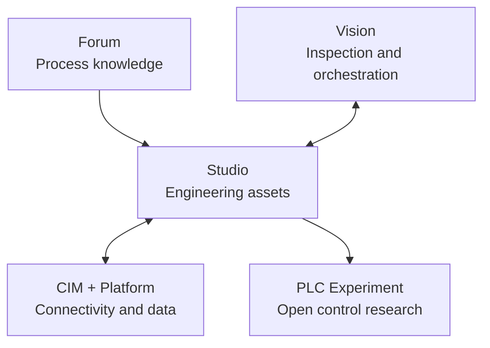

# openIndu

**An open-source, full-chain engineering tool stack for industrial automation and non-standard equipment.**

> Share process knowledge · Build tools together · Reuse engineering experience · Connect vision, control, and data

[Website](https://www.openindu.com/) · [Forum](https://forum.openindu.com/) · [中文](README_ZH.md) · [Community](https://github.com/openIndu/community)

---

## Why openIndu

Industrial engineering knowledge is often scattered across personal folders, project chats, vendor-specific tools, and one-off delivery code. A problem may be solved on one line, then rediscovered from scratch on the next.

openIndu is building a place where engineers can:

- **discuss process and field problems with context** — equipment, versions, constraints, validation, and known boundaries;
- **co-develop open engineering tools** — for electrical design, control, vision, connectivity, and industrial data;
- **turn reusable experience into shared assets** — guides, templates, mappings, examples, and reproducible tests.

The community is for people who build, integrate, commission, and maintain industrial equipment. We value reproducible engineering evidence over slogans and vendor-neutral collaboration over lock-in.

---

## One community, three ways to participate

| Area | What happens there | Start here |
| --- | --- | --- |
| **Forum — knowledge** | Field questions, process flows, selection methods, validation plans, failure records, and industry observations | [forum.openindu.com](https://forum.openindu.com/) |
| **Code — tools** | Open projects that connect engineering design, workstation applications, vision, control, CIM, and industrial data | [github.com/openIndu](https://github.com/openIndu) |
| **Engineering collaboration** | Issues, reviews, examples, templates, and problem-driven cooperation around real equipment work | [Community repository](https://github.com/openIndu/community) |

Knowledge does not have to arrive as a finished answer. Forum topics may remain open for continued discussion as new environments, evidence, and constraints appear.

---

## What is in the forum

The [openIndu Forum](https://forum.openindu.com/) is live and currently organized around six areas:

- [**Industrial control**](https://forum.openindu.com/c/industrial-control/5) — PLC, DCS, motion, servo, HMI/SCADA, fieldbus, and industrial protocols;
- [**Automation**](https://forum.openindu.com/c/automation/6) — non-standard equipment, line integration, machine vision, host applications, IIoT, and edge computing;
- [**Manufacturing process**](https://forum.openindu.com/c/process/7) — process flows, equipment steps, parameters, inspection, defects, and yield improvement;
- [**Industry insights**](https://forum.openindu.com/c/9) — companies, product portfolios, industrial software, and technology evolution;
- [**Community help**](https://forum.openindu.com/c/community/8) — questions, careers, learning resources, and collaboration;
- [**Feedback and suggestions**](https://forum.openindu.com/c/feedback/2) — forum feedback, feature requests, bugs, categories, and tags.

Published process articles currently cover display panels, semiconductors, batteries, automotive electronics, industrial robots, and photovoltaic modules. Content coverage is not a claim that openIndu already provides validated delivery capability in every industry.

---

## Project map

The project map connects five directions. It describes how the parts relate; it is **not** a claim that every direction is production-ready.

```mermaid
flowchart TB
    F[Forum<br/>Process knowledge]
    V[Vision<br/>Inspection and orchestration]
    S[Studio<br/>Engineering assets]
    C[CIM + Platform<br/>Connectivity and data]
    P[PLC Experiment<br/>Open control research]

    F --> S
    V <--> S
    S <--> C
    S --> P
```

| Direction | Purpose | Current public entry |
| --- | --- | --- |
| **Forum** | Community-owned process knowledge and engineering discussion | [openIndu Forum](https://forum.openindu.com/) |
| **Vision** | Cross-camera and cross-algorithm inspection workflow exploration | Follow the organization repositories and roadmap |
| **Studio** | Engineering assets and generation workflows | [openIndu-studio](https://github.com/openIndu/openIndu-studio) |
| **CIM + Platform** | Equipment connectivity, manufacturing integration, data, and traceability | [openIndu-platform](https://github.com/openIndu/openIndu-platform) |
| **PLC Experiment** | RK3588 + openEuler + RTOS/real-time Linux + EtherCAT exploration | [Technical discussion](https://forum.openindu.com/t/74) |

[openindu-station](https://github.com/openIndu/openindu-station) is the cross-cutting workstation application: it brings engineering assets, motion, vision, process execution, and data integration closer to equipment delivery.

### PLC experiment boundary

The open PLC direction is currently **Experiment / E0**. It is a research route and experimental plan, not a production-ready controller. Real-time behavior, hardware-in-the-loop testing, long-duration stability, fault recovery, compatibility, and safety boundaries still require evidence. It must not be presented as a replacement for commercial hardware PLCs.

---

## How we describe maturity

We separate plans from evidence. Public project and capability descriptions should use explicit states such as:

- **Available** — usable with a documented entry point;
- **Preview** — accessible for early evaluation, with known limitations;
- **Experiment** — a technical hypothesis or prototype under validation;
- **Planned** — accepted direction without a usable implementation yet;
- **Content** — published knowledge, not software capability.

Repository code, a forum article, and production evidence are different things. Each repository's README, releases, tests, and license remain the authoritative source for that project's current state.

---

## Contribute

You do not need a large pull request to contribute. Useful contributions include:

- a field question with equipment, software/firmware version, symptoms, attempted methods, and unresolved points;
- a reproducible test, failure record, or compatibility note;
- an ESI configuration, device mapping, engineering template, or example;
- a correction that clarifies where an article or design does **not** apply;
- code, documentation, issue triage, and review.

Before sharing field material, remove customer names, personal information, accounts, IP addresses, credentials, confidential recipes, and anything you are not authorized to publish. Safety circuits and hazardous operations must not be treated as copy-and-run instructions without independent validation.

Start with the [forum](https://forum.openindu.com/), read the [community contribution guide](https://github.com/openIndu/community), or explore the [openIndu repositories](https://github.com/openIndu).

---

Licenses are defined by each repository's LICENSE file. Project status and evidence may change; verify the linked repository, release, tests, and documentation before use.

© 2026 openIndu Community
