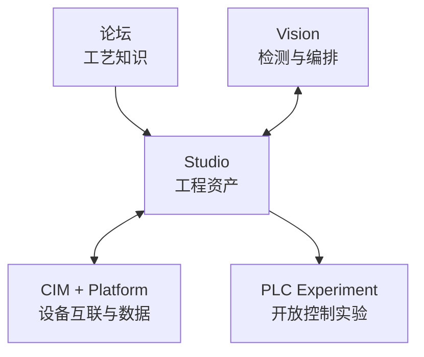

# openIndu

**面向工业自动化与非标设备的开源全链路工程工具栈社区。**

> 分享工艺 · 共建工具 · 复用工程经验 · 连接视觉、控制与数据

[官网](https://www.openindu.com/) · [论坛](https://forum.openindu.com/) · [English](README.md) · [社区仓库](https://github.com/openIndu/community)

---

## 为什么需要 openIndu

工业现场的工程知识经常散落在个人文件夹、项目群、厂商专用软件和一次性交付代码里。一个问题在这条产线上解决了，换到下一条产线，工程师可能还得重新查资料、试参数、走一遍弯路。

openIndu 希望和工程师一起：

- **带着上下文讨论工艺与现场问题**——说明设备、版本、约束、验证过程与已知边界；
- **共同建设开放的工程工具**——覆盖电气设计、控制、视觉、设备互联和工业数据；
- **把可复用经验变成共享资产**——包括指南、模板、映射、示例和可复现实验。

社区面向真正参与工业设备设计、集成、调试和维护的人。我们重视可复核的工程证据，不依赖口号；重视跨品牌协作，不制造新的厂商锁定。

---

## 一个社区，三种参与方式

| 方向 | 在这里做什么 | 从哪里开始 |
| --- | --- | --- |
| **论坛——知识** | 讨论现场问题、工艺流程、选型方法、验证计划、失败记录与行业观察 | [forum.openindu.com](https://forum.openindu.com/) |
| **代码——工具** | 共建连接工程设计、工站应用、视觉、控制、CIM 和工业数据的开源项目 | [github.com/openIndu](https://github.com/openIndu) |
| **工程协作** | 围绕真实设备工作提交 Issue、评审、示例、模板和问题驱动的协作 | [community 仓库](https://github.com/openIndu/community) |

知识不必以“标准答案”的形式出现。随着新环境、新证据和新约束出现，论坛话题可以持续补充和讨论，不强制结案。

---

## 论坛里有什么

[openIndu 社区论坛](https://forum.openindu.com/)已经上线，目前包含六个板块：

- [**工控**](https://forum.openindu.com/c/industrial-control/5)——PLC、DCS、运动控制、伺服、HMI/SCADA、现场总线与工业协议；
- [**自动化**](https://forum.openindu.com/c/automation/6)——非标设备、产线集成、机器视觉、上位机、工业物联网与边缘计算；
- [**工艺**](https://forum.openindu.com/c/process/7)——工艺流程、设备工序、参数、检测、缺陷与良率改善；
- [**行业洞察**](https://forum.openindu.com/c/9)——企业、产品组合、工业软件与技术演进；
- [**交流互助区**](https://forum.openindu.com/c/community/8)——提问、职业发展、学习资料与合作交流；
- [**社区反馈和建议**](https://forum.openindu.com/c/feedback/2)——论坛建议、功能需求、Bug、板块与标签申请。

当前已发布的工艺文章覆盖面板、半导体、电池、汽车电子、工业机器人和光伏组件。文章覆盖某个行业，不代表 openIndu 已经具备该行业的工程交付能力或已经完成模板验证。

---

## 项目地图

当前项目地图由五个方向组成。它用于说明各部分如何协作，**不代表每个方向都已经达到生产可用状态**。

| 方向 | 作用 | 当前公开入口 |
| --- | --- | --- |
| **Forum** | 社区共同沉淀工艺知识与工程讨论 | [openIndu 论坛](https://forum.openindu.com/) |
| **Vision** | 跨相机、跨算法的视觉检测工作流探索 | 关注组织仓库与路线图 |
| **Studio** | 工程资产与生成工作流 | [openIndu-studio](https://github.com/openIndu/openIndu-studio) |
| **CIM + Platform** | 设备互联、制造系统集成、数据与追溯 | [openIndu-platform](https://github.com/openIndu/openIndu-platform) |
| **PLC Experiment** | RK3588 + openEuler + RTOS/实时 Linux + EtherCAT 技术探索 | [技术讨论](https://forum.openindu.com/t/74) |

[openindu-station](https://github.com/openIndu/openindu-station) 是横跨多个方向的工站应用：让工程资产、运动控制、视觉、工艺执行和数据互联更接近设备交付现场。

### 软 PLC 实验边界

软 PLC 方向目前处于 **Experiment / E0**。它是技术路线研究与实验方案，不是生产可用控制器。实时性、硬件在环、长时间稳定性、故障恢复、兼容性与安全边界仍需建立证据，不得将其宣传为商业硬 PLC 的替代品。

---

## 如何表达成熟度

我们把计划和证据分开。公开项目与能力说明应明确使用以下状态：

- **Available**——已有可用能力和清楚的使用入口；
- **Preview**——可供早期试用，但仍有明确限制；
- **Experiment**——正在验证的技术假设或原型；
- **Planned**——已经接受的方向，尚无可用实现；
- **Content**——已经发布的知识内容，不等于软件能力。

仓库里有代码、论坛里有文章和已经取得生产证据，是三件不同的事。每个项目的实际状态，应以对应仓库的 README、Release、测试结果和许可证为准。

---

## 参与贡献

贡献不一定是一份很大的 PR。以下内容都有价值：

- 一条说明设备、软件或固件版本、现场现象、尝试方法和未解决问题的提问；
- 一份可复现实验、失败记录或兼容性说明；
- 一份 ESI 配置、器件映射、工程模板或示例；
- 一条说明文章或设计“在哪些条件下不适用”的修正；
- 代码、文档、Issue 分类和评审。

分享现场资料前，请删除客户名称、个人信息、账号、IP 地址、凭据、保密配方以及其他无权公开的内容。涉及安全回路与危险动作的信息，未经独立验证，不能作为照搬即用的现场操作指令。

可以从[论坛](https://forum.openindu.com/)发起第一个问题，阅读[社区贡献指南](https://github.com/openIndu/community)，或者浏览 [openIndu 项目仓库](https://github.com/openIndu)。

---

各项目许可证以对应仓库的 LICENSE 文件为准。项目状态与证据可能变化，使用前请核对仓库、Release、测试结果与文档。

© 2026 openIndu Community
